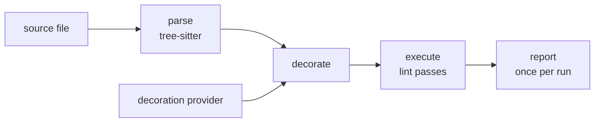

# Architecture

Whisker is a linting platform built on [tree-sitter][ts]. It lints Rust
today. Whisker ships no rules of its own. Aonyx's rules live in
[whisker-aonyx-rules][rules] and cover what Clippy does not, like derive
ordering and wildcard match arms.

This document describes the shape of the platform. Each crate documents
its own API, and each lint crate documents its own rule.

## The core idea

Most of what a lint needs to know is syntactic, and syntax is cheap. A
tree-sitter grammar parses a source file in isolation, without a
toolchain, a build, or a valid project. Some lints need semantic facts a
syntax tree cannot supply. Is this match scrutinee an enum? Does this
function return `Result`? Semantics is expensive, because it needs a real
toolchain with knowledge of the whole project.

Whisker keeps the two apart. The platform parses files with tree-sitter
and walks the syntax tree through lint rules. Semantic information enters
as **decorations**: typed values that a language provider computes up
front and attaches to individual syntax nodes. Rules read decorations off
the tree and never talk to a toolchain themselves.

That split keeps rules cheap. A rule is a function of a decorated tree. A
test can therefore give it decorations it built itself, and the rule still
makes type-aware decisions.

## The pipeline

The check command runs three stages for every file and one for the run:

1. **Parse.** The command builds one parser, fixed to the Rust grammar,
   before it visits any file. A file's extension decides whether discovery
   collects it. The tree, its source text, and an empty decoration map
   together form a decorated tree.
2. **Decorate.** The pipeline offers the tree to every provider. A provider
   either covers the file and returns its decorations, or declines it with
   a reason. This is the only stage that touches a language toolchain.
   Decorations merge in provider order, and the first decoration of a type
   on a node is the one rules see.
3. **Execute.** A depth-first walk over the named nodes offers every node
   to every lint pass and collects the diagnostics they return.
4. **Report.** After the last file, the command renders every diagnostic to
   stderr with its span, its supporting annotations, and its suggested
   fixes.

The pipeline is synchronous and handles one file at a time. The command
loads the provider once per run and constructs a fresh set of lint passes
for every file, because passes hold state.

### Coverage

A file that no provider covers is an error. Whisker runs no rule on it,
syntactic rules included, because a clean result would hide code that no
rule inspected. A provider declines a file for one of four reasons. The
file sits outside the root the provider loaded, no crate reaches it, the
toolchain excluded it, or its text differs from the toolchain's copy. The
command prints one `help:` line per reason across the whole
run, after the per-file errors. The run then fails. With `--keep-going`,
the walk continues past the file and still exits non-zero.

Discovery decides which files reach the pipeline. It walks the target the
way git and ripgrep do, honors every ignore file, and applies the `ignore`
patterns from the configuration. The README describes those rules.

## Language support

A language plugs into the platform at two points: a lint pass trait that
whisker generates, and a decoration provider that talks to the toolchain.

### The lint pass trait

A tree-sitter grammar ships a machine-readable description of its node
types. Whisker keeps a copy of Rust's at
`crates/whisker-rust/src/node-types.json`. A build script generates from
it a trait with one method per named node kind, plus the dispatch that
routes a node to its method. Rules hook the constructs they care
about by name. Grammars also group node kinds into supertypes, so a rule
can hook every expression at once.

The copy tracks the grammar by hand. A grammar update changes the trait
once someone refreshes the copy, and a renamed node then breaks
compilation at every rule that hooked it. Until the refresh, the parser
and the trait describe different grammars, and a rule that hooked the old
name stops firing.

### The decoration provider

Rust's provider uses [rust-analyzer][ra] as a library. The command loads
it once per run. The load discovers the Cargo manifest nearest the checked
path, resolves that workspace, runs its build scripts, and builds the
analysis database. A `whisker check` therefore needs a Cargo project, and it
executes that project's build scripts before it lints anything. The load
enables the `test` cfg, so code under `#[cfg(test)]` resolves like any
other code. It runs no proc-macro server, so code that a proc macro
produces receives no decorations.

For every file it covers, the provider resolves a fixed set of node kinds.
Those are function items, match scrutinees, else branches, the operand of
`?`, and use declarations. It records what it finds as decorations: function
signatures, resolved types, ADT flags, and import sources. The set belongs
to the provider, and a rule that needs a decoration on another node kind
needs a change to whisker-rust.

The provider and the syntax tree keep separate parses of the same file, so
byte offsets tie them together. The provider compares the text the
database holds with the text the pipeline parsed, and declines the file
when they differ.

The rust-analyzer stack sits behind the crate's default `provider`
feature. A lint crate switches it off and depends on the generated trait,
the adapter, and the decoration types alone.

### Decorations

Decorations are typed values. Each type declares whether a provider
records it at most once per node or repeatedly, and the declaration
travels with the type. A rule that reads a decoration through `get`
receives an `Option` or a `Vec` as the type dictates. The plain
`decoration` accessor stays available and checks nothing.

The decoration map recovers a value by a name-based key: the type's module
path, its name, and a hash of its definition. `TypeId` cannot serve,
because it differs between separately compiled crate graphs, and a plugin
is one.

## Lint rules

A rule implements the generated trait and emits diagnostics with a stable
rule ID and a severity. Rules ship in lint crates. `export_lints!` takes a
list, so one crate can carry several rules, and Aonyx keeps one rule per
crate. Whisker links no rules itself. A check runs exactly the rules its
configured sources export, and the configuration has no switch for one
rule inside a source.

Rules that depend on decorations **fail open**. A decoration is only ever
evidence. Where a decoration is the reason to report, a missing one keeps
the rule silent. Where a decoration would exempt the code, a missing one
leaves the diagnostic standing. Whisker prefers a missed finding to a
finding it cannot justify.

## Custom lints

A project names its lint crates in `.config/whisker.toml`. Whisker finds
that file by climbing from the checked path to the file or to a `.git`
directory. The file has two keys: `ignore` and `lints`. Each `lints` entry
names a directory, or a repository pinned to one commit.

`whisker check` resolves every entry before it compiles any of them, so a
typo in the second entry surfaces before the first entry's build. Every
network request whisker makes itself happens in that stage. Cargo may
still reach the network during a build, for a dependency the machine has
not downloaded before.

A git entry becomes a directory in the cache and is then a directory like
any other. The cache is `WHISKER_CACHE_DIR` when it is set. Otherwise it is
the XDG cache directory plus `whisker`, which is `~/.cache/whisker` on
every platform. A checkout lives at `<cache>/git/<remote>/<rev>/`. Whisker
assembles it in a sibling directory and renames it into place, so a
checkout that exists is whole.

The fetch uses gitoxide. It asks the remote for the pinned commit by hash,
at depth one, and declines tags. Gitoxide replaces only the transport: the
machine's git configuration still applies, and a private remote fetches
with the credentials the home directory carries. The fetch ignores the
`GIT_*` environment, so a run inside a git hook cannot be redirected onto
the repository being committed. A commit hash names an immutable tree, so
whisker never refreshes a checkout that exists and never asks the remote
about it again.

Whisker runs `cargo build --release` in the directory, with the cargo that
`CARGO` names or the one on `PATH`. Only a git entry builds with
`--locked`, because the pinned commit fixes the rules only when the
lockfile fixes their dependencies. Cargo's target directory sits inside
the checkout, so a second run over the same pin is a warm build.

A directory may hold one package or a workspace of them. Whisker loads
every dynamic library the build produced, and each one completes its own
handshake. That is what lets a repository of rules arrive through a single
entry.

## Prebuilt lints

A git entry can arrive as libraries that its publisher compiled. Whisker
takes the cheapest answer the machine already holds. Prebuilt libraries it
unpacked before come first. A checkout it already holds comes next. Only a
machine with neither asks the remote's releases, and only when that
answers with nothing does whisker fetch the source. A project with a warm
checkout therefore keeps compiling it after its rules start to publish
archives. Someone moves the pin or clears the cache to pick them up.

A compile costs a toolchain and several minutes, on every machine and
every build agent that pins the same commit. A released whisker binary
also cannot compile lints on most machines. The handshake accepts a
library only from the rustc that built whisker, and whoever downloaded the
binary does not have that rustc.

Whisker asks the remote's releases for an archive named
`<rev>-<tag>.tar.gz`, where the tag is the one `whisker abi` prints. The
tag is a digest of every value the handshake compares, followed by the
target triple the build script baked in. An archive published under a
whisker's tag passes that whisker's handshake. A prebuilt library that
fails the handshake ends the run and names the directory to delete. The
publisher named that archive with a tag that does not describe it.

Whisker checks the archive against the `.sha256` published beside it, then
unpacks it into `<cache>/prebuilt/<remote>/<rev>/<tag>/`, staged and
renamed the way a checkout is. Both layouts derive `<remote>` from the
same function. Whisker unpacks only regular files at the archive's root.
That one rule keeps every entry inside the directory, and it passes over a
symbolic link, which is no regular file.

The digest proves that the download arrived intact. The same publisher
writes the archive and the digest, so it establishes nothing about trust.
Neither does the handshake, which proves compatibility. Trust comes from
the configuration: a configured repository of lints runs its code in
whisker's process, prebuilt or compiled.

A missing archive never fails the lookup. Whisker says nothing when the
remote is not on GitHub, when the API answers 404, and when no release
names an archive for this whisker. That is the ordinary case for a project
whose rules nobody publishes prebuilt. Whisker then compiles the source,
and on a machine without the matching toolchain that build fails. Every
other failure prints one line on stderr before the source build:

- an API whisker cannot reach, or one that answers with an error
- a digest that does not match
- an archive that will not unpack
- a cache directory whisker cannot write

The exchange with the API runs on a thread of its own. The HTTP client
owns an asynchronous runtime, the check command is itself asynchronous,
and a runtime dropped inside another panics.

Whisker reads `GH_TOKEN`, then `GITHUB_TOKEN`, for a private repository,
and sends the token only to the API host. `WHISKER_GITHUB_API_URL` points
it at a GitHub Enterprise installation. Every request has a timeout, and
every body whisker reads has a size limit.

## The plugin boundary

Rust has no stable ABI. A loaded library is coherent with the whisker
binary only when the same rustc compiled both and both lay the boundary
out the same way. The loader establishes that before it calls anything the
plugin defines. A `dlopen` runs the library's initializers, so the
handshake is a compatibility gate, and trust comes from the configuration
as the previous section says.

The plugin exports a declaration. The loader reads its leading protocol
version through a raw pointer, and only a matching version licenses a
reference to the whole struct. It then compares, in order, the rustc
version string and two fingerprints: one for whisker-types and one for
whisker-rust. The first mismatch refuses the library with an error that
says what to rebuild. Only then does the loader call the plugin's
registration function.

The handshake guards against silence. A plugin built against drifted
source would mostly work, and rules fail open, so a wrong answer would
pass unnoticed. The handshake turns it into a refusal.

The fingerprints hash layout. Each names a list of types that cross the
boundary and records the size and alignment of every one. For
`Diagnostic`, `Span`, `Suggestion`, `Location`, and `DecoratedNode` it
also records every field offset. The whisker-rust fingerprint also hashes
the generated lint pass trait as text, because a trait has no layout a
const can read. Doc comments and private helpers move nothing, so a plugin
stays loadable across most of whisker's own churn.

Layout cannot see the method order of `LintPass` and `LintRegistrar`,
because a vtable orders its methods by declaration. Those belong to the
declaration's `ABI_VERSION`. A test scans both traits' source and fails
when either method list moves, so the test reminds a contributor to bump
it.

The fingerprints stop at whisker's own layout. A contributor maintains
each list of types by hand. A fieldless enum keeps its size and alignment
when its variants reorder, so the fingerprint does not see that change. A
decoration's key hashes its definition text, so an edit to that text
changes the key without changing any fingerprint. The plugin's lockfile
resolves its own `tree-sitter`. Its `Node` is a `#[repr(transparent)]`
wrapper around a `#[repr(C)]` struct of the C library, so a version
difference moves no field. Each image still carries its own copy of that
library. Nothing on the call path catches a panic, and nothing checks the
plugin's allocator or panic strategy. A plugin must not set a
`#[global_allocator]`, because the host frees values the plugin allocated.

The loader keeps every library loaded for the life of the process. The
registered factories and every `RuleId` a plugin mints point into the
library's image.

## Workspace layout

The platform lives in `crates/`. Rules live in their own repository. Two
plugin packages stay here for the tests that need one.
`examples/custom_lint` is the template a rule is written from.
`crates/whisker-rust/tests/fixtures/lints/decoration_probes` reads
decorations, so the provider's output stays under test. Both sit outside
the workspace and keep their own lockfiles, the way a plugin written
elsewhere does. The workspace test run builds and loads them through the
CLI, and `just test-example-lint` and `just test-fixture-lint` run their
own tests.

| Crate               | Role                                                                                     |
| ------------------- | ---------------------------------------------------------------------------------------- |
| `whisker-types`     | Shared vocabulary: trees, decorations, diagnostics, coverage, and the plugin declaration |
| `whisker-core`      | The pipeline and tree walker                                                             |
| `whisker-codegen`   | Generates a lint pass trait from `node-types.json`                                       |
| `whisker-rust`      | Rust support: the generated trait, the decorations, and the provider                     |
| `whisker-macros`    | The derive macro for decoration types                                                    |
| `whisker-reporting` | Diagnostic rendering                                                                     |
| `whisker-testing`   | Test harness for lint rules                                                              |
| `whisker`           | The CLI, custom lint loading, and the plugin handshake                                   |

Dependencies flow one way. `whisker-types`, `whisker-codegen`, and
`whisker-macros` depend on no other whisker crate. `whisker-core` and
`whisker-reporting` rest on `whisker-types`. `whisker-rust` rests on
`whisker-types` and `whisker-macros`, and uses `whisker-codegen` at build
time. `whisker-testing` rests on `whisker-core`. The CLI ties the platform,
the language, and the loaded lints together.

[ra]: https://rust-analyzer.github.io/
[rules]: https://github.com/aonyx-ai/whisker-aonyx-rules
[ts]: https://tree-sitter.github.io/tree-sitter/
