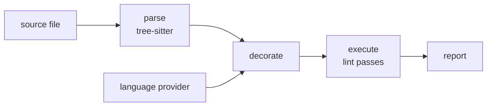

# Architecture

Whisker is a language-agnostic linting platform built on [tree-sitter][ts].
It ships no rules of its own; Aonyx's live in
[whisker-aonyx-rules][rules] and cover what Clippy does not, like derive
ordering and wildcard match arms.

This document describes the shape of the platform. Individual crates
document their own APIs, and each lint crate documents its own rule.

## The core idea

Most of what a lint needs to know is syntactic, and syntax is cheap: a
tree-sitter grammar parses any source file in isolation, without a
toolchain, a build, or even a valid project. Some lints, however, need
semantic facts a syntax tree cannot supply — "is this match scrutinee an
enum?", "does this function return `Result`?" — and semantics is
expensive, requiring a real toolchain with knowledge of the whole project.

Whisker separates the two. The platform parses files with tree-sitter and
walks the syntax tree through lint rules. Semantic information enters only
as **decorations**: annotations a language provider computes up front and
attaches to individual syntax nodes. Rules read decorations off the tree;
they never talk to a toolchain themselves.

That split is what keeps rules cheap. A rule is a pure function of a
decorated tree, so it can be tested against hand-constructed decorations
rather than a real toolchain, while still making type-aware decisions.

## The pipeline

Every file flows through four stages:

1. **Parse.** The file is parsed with the tree-sitter grammar for its
   language, detected from the file extension. The tree, its source text,
   and an empty decoration map together form a decorated tree.
2. **Decorate.** Each registered provider inspects the tree and records
   decorations against individual nodes. This is the only stage that
   touches a language toolchain.
3. **Execute.** A depth-first walk over the named nodes offers every node
   to every lint pass and collects the diagnostics they return.
4. **Report.** Diagnostics render to stderr with spans, supporting
   annotations, and suggested fixes.

The pipeline is synchronous and per-file. There is no scheduling, caching,
or parallelism yet.

## Language support

A language plugs into the platform at two seams.

The first is its **lint pass trait**, which is generated rather than
written. A tree-sitter grammar ships a machine-readable description of its
node types, and whisker turns that into a trait with one method per node
kind, plus the dispatch that routes a node to the right method. Rules
therefore hook the constructs they care about by name instead of matching
on kind strings, the trait cannot drift from the grammar, and a grammar
update that renames a node breaks compilation at the rules that used it.
Grammars also group node kinds into supertypes, so a rule can hook every
expression at once rather than each expression kind in turn.

The second is its **decoration provider**, the bridge to a real toolchain.
Rust's is backed by [rust-analyzer][ra] used as a library: it loads the
target workspace once, then resolves the handful of node positions the
lints ask about — function signatures, match scrutinees, and similar — and
records what it finds. The provider and the syntax tree keep separate
representations of the same file, so byte offsets are what tie them
together.

Decorations are typed values rather than strings, and each decoration type
declares whether a provider records it at most once per node or
repeatedly. Because that choice travels with the type, a rule that reads a
repeated decoration as though it were singular fails to compile.

## Lint rules

Each rule is its own crate implementing its language's generated trait,
emitting diagnostics with a stable rule ID and a severity. Rules are
linked into the CLI explicitly, so a lint runs only when it has been
deliberately enabled.

Rules that depend on decorations **fail open**: when a decoration is
missing — the provider could not resolve the type, or no provider ran —
the rule stays silent rather than guessing. Whisker would rather miss a
finding in code it cannot analyze than report one it cannot justify.

## Custom lints

A target project can configure lint crates of its own, and `whisker
check` compiles each one at check time, loads the built dynamic library,
and runs the exported rules. There is nothing else to run: whisker links
no rules, so a rule the configuration omits does not run however complete
its own tests are, and nothing is enabled by default. Aonyx's own rules are
plugins on exactly these terms: they live in [whisker-aonyx-rules][rules],
and `.config/whisker.toml` names that repository and the commit to take it
from. A rule written anywhere else is written the same way — the same
generated trait, the same decorations, the same test harness — and enters
through `export_lints!` rather than a pass list in the binary.

An entry names either a directory or a repository pinned to one commit.
The two meet immediately: a git entry is fetched into a cache under
`~/.cache/whisker` and from there is a directory like any other. The fetch
asks the remote for that single commit, at depth one, over gitoxide rather
than the `git` binary, so whisker's behavior does not depend on which git
a machine has or whether it has one. Because a commit hash names an
immutable tree, a checkout that exists is never refreshed and never
revalidated against the remote, which is what keeps the network out of the
common path. Only a git entry builds with `--locked`: the pin is worth
what the lockfile behind it is worth.

A directory may hold one package or a workspace of them, and every dynamic
library the build produces is loaded and handshaken separately. That is
what lets a repository of rules arrive through a single entry rather than
one entry per rule.

Rust has no stable ABI, so a loaded library is only coherent with the
whisker binary when the same rustc compiled both and both lay the
boundary out the same way. Whisker establishes that before trusting
anything: the plugin's declaration carries the compiler's identity and a
fingerprint of each side of the boundary, and the loader refuses the
library at the first mismatch.

The failure mode this guards against is not a crash but silence — a
plugin built against drifted source would mostly _seem_ to work, and
rules fail open — so the handshake turns an invisible wrong answer into
a visible refusal. For the same reason, decorations are recovered by a
name-based key rather than `TypeId`, which is not stable across
separately compiled crate graphs.

The fingerprints hash layout, not source text: the size, alignment, and
field offsets of every type that crosses, plus the lint pass trait
whisker-rust generates from the grammar. An earlier revision hashed the
crates' source directories, which meant a doc comment refused every
plugin in the tree until each was rebuilt — a cost that scales with the
number of plugins and buys nothing, since text that moves no field
threatens nothing. What layout cannot cover is the method order of
`LintPass` and `LintRegistrar`, because a vtable is ordered by
declaration and no const reads that back; those belong to the
declaration's `ABI_VERSION`, and a test fails when either trait's method
list moves so the bump is not left to memory.

The fingerprints reach whisker's own layout, not the graph a plugin's
lockfile resolves for itself. `tree_sitter::Node` crosses the boundary
as a `#[repr(transparent)]` wrapper around a `#[repr(C)]` struct of the
C library, so a version difference there moves no field, but it does
give each image its own copy of that library. Whisker documents that
residual risk rather than pinning every version a plugin resolves.

Whisker once shipped its rules as compiled plugins through Dylint and
deliberately retired that (#193). Custom lints re-enter the idea on
whisker's own terms: the boundary is the narrow `LintPass` trait rather
than rustc's internals, and compatibility is checked instead of assumed.

## Workspace layout

The platform lives in `crates/`, and that is all of it. Rules live in their
own repository. Two plugin packages stay here for the tests that need one:
`examples/custom_lint`, which is the template a rule is written from, and
`crates/whisker-rust/tests/fixtures/lints/decoration_probes`, which reads
decorations so the provider's output stays under test. Both sit outside the
workspace, resolving their own dependencies the way a plugin written
elsewhere does, so the workspace test run does not reach them and
`just test-example-lint` and `just test-fixture-lint` do.

| Crate               | Role                                               |
| ------------------- | -------------------------------------------------- |
| `whisker-types`     | Shared vocabulary: trees, decorations, diagnostics |
| `whisker-core`      | The pipeline and tree walker                       |
| `whisker-codegen`   | Generates per-language lint pass traits            |
| `whisker-rust`      | The Rust language support                          |
| `whisker-macros`    | Derive macro for decoration types                  |
| `whisker-reporting` | Diagnostic rendering                               |
| `whisker-testing`   | Test harness for lint rules                        |
| `whisker`           | The CLI                                            |

Dependencies flow one way: everything rests on `whisker-types`,
`whisker-core` adds the pipeline, a language crate builds on both, and the
CLI ties the platform, a language, and the lints together.

[rules]: https://github.com/aonyx-ai/whisker-aonyx-rules
[ra]: https://rust-analyzer.github.io/
[ts]: https://tree-sitter.github.io/tree-sitter/
