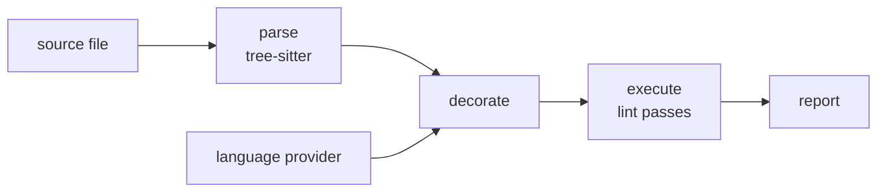

# Architecture

Whisker is a language-agnostic linting platform built on [tree-sitter][ts].
It ships with Rust lints that enforce Aonyx's coding conventions — rules
that Clippy doesn't cover, like derive ordering and wildcard match arms.

This document describes the shape of the platform. Individual crates
document their own APIs, and each lint crate documents its own rule.

## The core idea

Most of what a lint needs to know is syntactic, and syntax is cheap: a
tree-sitter grammar parses any source file in isolation, without a
toolchain, a build, or even a valid project. Some lints, however, need
semantic facts a syntax tree cannot supply — "is this match scrutinee an
enum?", "does this function return `Result`?" — and semantics is
expensive, requiring a real toolchain with knowledge of the whole project.

Whisker separates the two. The platform parses files with tree-sitter and
walks the syntax tree through lint rules. Semantic information enters only
as **decorations**: annotations a language provider computes up front and
attaches to individual syntax nodes. Rules read decorations off the tree;
they never talk to a toolchain themselves.

That split is what keeps rules cheap. A rule is a pure function of a
decorated tree, so it can be tested against hand-constructed decorations
rather than a real toolchain, while still making type-aware decisions.

## The pipeline

Every file flows through four stages:

1. **Parse.** The file is parsed with the tree-sitter grammar for its
   language, detected from the file extension. The tree, its source text,
   and an empty decoration map together form a decorated tree.
2. **Decorate.** Each registered provider inspects the tree and records
   decorations against individual nodes. This is the only stage that
   touches a language toolchain.
3. **Execute.** A depth-first walk over the named nodes offers every node
   to every lint pass and collects the diagnostics they return.
4. **Report.** Diagnostics render to stderr with spans, supporting
   annotations, and suggested fixes.

The pipeline is synchronous and per-file. There is no scheduling, caching,
or parallelism yet.

## Language support

A language plugs into the platform at two seams.

The first is its **lint pass trait**, which is generated rather than
written. A tree-sitter grammar ships a machine-readable description of its
node types, and whisker turns that into a trait with one method per node
kind, plus the dispatch that routes a node to the right method. Rules
therefore hook the constructs they care about by name instead of matching
on kind strings, the trait cannot drift from the grammar, and a grammar
update that renames a node breaks compilation at the rules that used it.
Grammars also group node kinds into supertypes, so a rule can hook every
expression at once rather than each expression kind in turn.

The second is its **decoration provider**, the bridge to a real toolchain.
Rust's is backed by [rust-analyzer][ra] used as a library: it loads the
target workspace once, then resolves the handful of node positions the
lints ask about — function signatures, match scrutinees, and similar — and
records what it finds. The provider and the syntax tree keep separate
representations of the same file, so byte offsets are what tie them
together.

Decorations are typed values rather than strings, and each decoration type
declares whether a provider records it at most once per node or
repeatedly. Because that choice travels with the type, a rule that reads a
repeated decoration as though it were singular fails to compile.

## Lint rules

Each rule is its own crate implementing its language's generated trait,
emitting diagnostics with a stable rule ID and a severity. Rules are
linked into the CLI explicitly, so a lint runs only when it has been
deliberately enabled.

Rules that depend on decorations **fail open**: when a decoration is
missing — the provider could not resolve the type, or no provider ran —
the rule stays silent rather than guessing. Whisker would rather miss a
finding in code it cannot analyze than report one it cannot justify.

## Workspace layout

The platform lives in `crates/`, each lint in `lints/`.

| Crate               | Role                                               |
| ------------------- | -------------------------------------------------- |
| `whisker-types`     | Shared vocabulary: trees, decorations, diagnostics |
| `whisker-core`      | The pipeline and tree walker                       |
| `whisker-codegen`   | Generates per-language lint pass traits            |
| `whisker-rust`      | The Rust language support                          |
| `whisker-macros`    | Derive macro for decoration types                  |
| `whisker-reporting` | Diagnostic rendering                               |
| `whisker-testing`   | Test harness for lint rules                        |
| `whisker`           | The CLI                                            |

Dependencies flow one way: everything rests on `whisker-types`,
`whisker-core` adds the pipeline, a language crate builds on both, and the
CLI ties the platform, a language, and the lints together.

[ra]: https://rust-analyzer.github.io/
[ts]: https://tree-sitter.github.io/tree-sitter/
