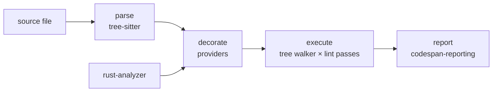

# Architecture

Whisker is a language-agnostic linting platform built on [tree-sitter][ts].
It ships with Rust lints that enforce Aonyx's coding conventions — rules
that Clippy doesn't cover, like derive ordering and wildcard match arms.

This document describes how the platform works as a whole. It does not
describe individual lints; see `specs/lints.md` for those.

## The core idea

Most of what a lint needs to know is syntactic, and syntax is cheap: a
tree-sitter grammar parses any source file in isolation, without a
toolchain, a build, or even a valid project. Some lints, however, need
semantic facts a syntax tree cannot provide — "is this match scrutinee an
enum?", "does this function return `Result`?" — and semantics is expensive,
requiring a real language toolchain with knowledge of the whole project.

Whisker separates the two. The platform parses files with tree-sitter and
walks the syntax tree through lint rules. Semantic information enters the
picture only as **decorations**: annotations that a language-specific
provider computes up front (for Rust, using [rust-analyzer][ra] as a
library) and attaches to individual syntax nodes. Lint rules read
decorations off the tree; they never talk to a toolchain directly.

This split keeps rules simple and fast to test — a rule is a pure function
of a decorated tree, so tests can hand-construct decorations instead of
spinning up rust-analyzer — while still letting rules make type-aware
decisions.

## The pipeline

Every file flows through four stages, orchestrated by
`whisker_core::Pipeline`:

1. **Parse.** The file is parsed with the tree-sitter grammar for its
   language (detected from the file extension). The result is wrapped in a
   `DecoratedTree`: the tree-sitter tree plus the source text, the file
   path, and an initially empty `DecorationMap`.
2. **Decorate.** Each registered `DecorationProvider` inspects the tree and
   inserts decorations into the map, keyed by tree-sitter node ID. This is
   the only stage that touches a language toolchain.
3. **Execute.** The tree walker performs a depth-first traversal of all
   named nodes. At every node it calls `check_node` on each `LintPass`,
   collecting the diagnostics they return. Passes take `&mut self`, so a
   rule may carry state; the CLI constructs a fresh set of passes per file
   so no state leaks across files.
4. **Report.** Diagnostics are rendered to stderr with
   [codespan-reporting][csr]: the primary span becomes the primary label,
   origin and related locations become secondary labels, and suggestions
   become notes.

## Workspace layout

The platform lives in `crates/`; each lint rule is its own crate in
`lints/`. The root `Cargo.toml` lists every lint crate as an explicit
workspace member and excludes the `lints/*` glob, so a newly created lint
does not join the workspace — or the build — until it is deliberately
added.

| Crate               | Role                                                |
| ------------------- | --------------------------------------------------- |
| `whisker-types`     | Shared vocabulary: trees, decorations, diagnostics  |
| `whisker-core`      | The parse-decorate-execute pipeline and tree walker |
| `whisker-codegen`   | Generates per-language lint pass traits at build    |
| `whisker-rust`      | The Rust language SDK (grammar, provider, adapter)  |
| `whisker-macros`    | The `#[derive(Decoration)]` proc macro              |
| `whisker-reporting` | Diagnostic rendering via codespan-reporting         |
| `whisker-testing`   | Test harness for lint rules                         |
| `whisker`           | The CLI binary                                      |

Dependencies flow strictly downward: everything depends on
`whisker-types`, `whisker-core` depends only on it, the Rust SDK sits on
top of both, and the CLI ties the platform, the SDK, and the lint crates
together.

### whisker-types

The vocabulary crate. It contains no analysis logic, only the types every
other crate communicates through:

- `DecoratedTree` — a parsed tree-sitter tree plus source text, file path,
  and the `DecorationMap`.
- `DecoratedNode` — a tree-sitter node bundled with references to the
  source and the decoration map. This is the type lint rules interact
  with: it exposes structural accessors (`kind`, `text`, children, field
  lookups) and decoration lookups.
- `DecorationMap` — per-node decoration storage. Values are type-erased
  behind `Box<dyn Any>` and retrieved by downcast, keyed by
  `(node ID, type)`. A node can carry several decorations of different
  types, or several of the same type.
- `Decoration` — a trait that fixes a decoration type's cardinality
  through a generic associated type: a decoration recorded at most once
  per node reads back as `Option<&T>`, one recorded repeatedly as
  `Vec<&T>`. Declaring cardinality on the type rather than at the call
  site makes "rule reads a repeated decoration as if it were singular" a
  compile error. `whisker-macros` derives this trait. `DecoratedNode`
  also exposes untyped accessors (`decoration::<T>()` and
  `decorations_of_type::<T>()`), which is how the current Rust
  decorations are read; the typed `get::<D>()` path is preferred for new
  decorations.
- `DecorationProvider` — the interface a language toolchain bridge
  implements: `decorate(&self, tree: &mut DecoratedTree)`.
- `LintPass` — the platform-level rule interface:
  `check_node(&mut self, node) -> Vec<Diagnostic>`, called for every named
  node.
- `Diagnostic` and friends — `RuleId`, `Severity` (`Error`, `Warn`,
  `Info`, `Help`), the primary `Span` (file plus byte range), and optional
  origin locations, related locations, and suggestions.
- `Language` — the enum of supported languages (currently only Rust) and
  extension-based detection.

### whisker-core

The engine, deliberately small. `Pipeline` owns a tree-sitter parser for
one language and runs the parse-decorate-execute sequence on a file or on
in-memory source. The tree walker is a plain recursive traversal that
visits named nodes and fans each one out to every pass. There is no
scheduling, caching, or parallelism here yet; the pipeline is synchronous
and per-file.

### whisker-codegen and the generated lint pass trait

The platform-level `LintPass` trait receives every node, which would force
each rule to match on node kind strings. Instead, whisker generates a
typed visitor per language. `whisker-codegen` reads a tree-sitter
grammar's `node-types.json` and emits Rust source containing:

- a trait (for Rust, `RustLintPass`) with one `check_{kind}` method per
  named node type in the grammar, each defaulting to "no diagnostics", and
- a `dispatch` function mapping a node's kind string to the matching
  method.

Grammar _supertypes_ (like `_expression`, an abstract grouping of many
concrete expression kinds) get methods too: `dispatch` resolves a
supertype's transitive concrete subtypes and calls the supertype method
for any of them, after the concrete method. A rule can therefore hook
`check_expression` once instead of every expression kind, and a node that
is both a concrete kind and a supertype member triggers both methods.

`whisker-rust`'s build script runs this generator over the vendored
`node-types.json` from tree-sitter-rust, so the trait always matches the
grammar version in use, and a grammar update that renames node kinds
surfaces as compile errors in rules rather than as silently dead code.

### whisker-rust

The Rust language SDK, in three parts.

**The generated trait**, included from `OUT_DIR` as described above.

**The adapter.** `RustLintPassAdapter` wraps any `RustLintPass` and
implements the platform's `LintPass` by delegating `check_node` to the
generated `dispatch`. This is the bridge that lets the language-agnostic
tree walker drive language-specific typed rules.

**The decoration provider.** `RustDecorationProvider` is where
rust-analyzer comes in. Loading is expensive and happens once per CLI run:
`load` builds rust-analyzer's database from the target project's
`Cargo.toml` (running Cargo underneath). Decoration is then cheap and
per-file, in two phases:

1. Walk the tree-sitter tree collecting _targets_ — the node positions
   whose types current lints care about: function items, match
   scrutinees, `if`/`else` alternatives, and `?` operands.
2. Resolve each target against rust-analyzer's semantic model and insert
   the results into the decoration map.

The two phases exist because tree-sitter and rust-analyzer each have
their own syntax tree for the same file. Byte offsets are the common
currency: a target records the tree-sitter node's start byte, the
provider finds the rust-analyzer node at that offset, and the resulting
decoration is stored under the tree-sitter node's ID.

Three decoration types are produced today, defined in
`whisker_rust::decorations`:

- `ResolvedType` — a display string plus flags: is it an enum, `Result`,
  `Option`, or the never type.
- `AdtFlags` — for enums, whether the type is `#[non_exhaustive]` and
  defined in an external crate (the case where a wildcard arm is
  unavoidable).
- `FnSignature` — a function's resolved return type and, for
  `Result`-returning functions, the error type's name.

The provider also has an `empty` constructor that attaches nothing, used
when semantic analysis isn't needed.

### whisker-reporting

Translates whisker diagnostics into codespan-reporting ones and renders
them. The testable core, `render_to_string`, takes pre-loaded sources and
returns the rendered text; `render` loads the sources from disk and emits
to stderr.

### whisker-testing

The harness lint crates test against, mirroring the pipeline's stages as
free functions: `parse` builds a `DecoratedTree` from a source snippet,
`decorate` swaps in a hand-constructed `DecorationMap`, and `execute` runs
passes through the real tree walker. Because decorations are plain values,
a test can assert a semantic lint's behavior — "this scrutinee is an
external non-exhaustive enum" — without a Cargo project or rust-analyzer
in sight. `assert_diagnostic` provides a fluent builder for checking rule
ID, severity, message, span, and attachment counts, and `fixtures` loads
directory-based test cases.

The provider itself is tested separately: `whisker-rust` has an
integration test that loads a real fixture Cargo project once and checks
the decorations rust-analyzer produces for it.

### The CLI

The `whisker` binary is built on the [clawless][cl] command framework.
`whisker check [path]`:

1. Walks the target directory (or takes a single file), collecting every
   file whose extension maps to a supported language.
2. Loads the `RustDecorationProvider` once for the target workspace.
3. Runs the pipeline on each file with a fresh set of lint passes.
4. Renders all collected diagnostics and exits non-zero if any diagnostic
   has severity `Error` or above, or if any file failed under
   `--keep-going` (without the flag, the first failure aborts the run).

The set of lints that runs is hardcoded in the CLI's
`create_lint_passes`: every rule crate is linked in and wrapped in a
`RustLintPassAdapter` there. A rule that is not in that list does not run,
however complete its own tests are.

## Lint crates

Each rule is a separate crate under `lints/`, depending only on
`whisker-rust` and `whisker-types` (plus `whisker-testing` for tests). A
rule is a unit struct implementing `RustLintPass` for the node kinds it
cares about, emitting `Diagnostic`s with a stable `RuleId` like
`lint.wildcard-match-arm`.

Semantic rules read decorations and **fail open**: if a decoration is
absent — because the provider couldn't resolve the type, or because the
file was analyzed without a provider — the rule stays silent rather than
guessing. This keeps false positives out at the cost of missing findings
in unanalyzable code.

## Specs and traceability

Behavior is specified in `specs/*.md` as requirement rules with stable
IDs (`r[cli.check]`, `r[lint.wildcard-match-arm.detect]`, …).
Implementation sites carry matching `r[impl …]` comments, and
[Tracey][tracey] maps the two together; `just check-tracey` validates the
mapping as part of pre-commit. When changing behavior, update the spec
rule and its `r[impl]` annotations together.

## Development workflow

The development environment is managed with [Flox][flox], and the
`justfile` runs every recipe inside it. `just pre-commit` runs the full
gauntlet: formatting (rustfmt with unstable options, prettier, taplo),
linting (clippy with `-D warnings`, markdownlint, zizmor), tests, and
Tracey validation. Tests lean on property-based testing
with proptest, and every custom type carries `Send`/`Sync`/`Unpin` trait
tests by convention.

## Extending the platform

**A new lint** is a new crate in `lints/`: implement `RustLintPass`, spec
the rule in `specs/lints.md`, test it through `whisker-testing`, then
register it in the root `Cargo.toml` members list and in the CLI's
`create_lint_passes`.

**A new decoration** is a type (derived with `#[derive(Decoration)]` to
fix its cardinality), a new `Target` variant in the provider's collection
walk, and resolution logic against the semantic model.

**A new language** is a `Language` variant, a tree-sitter grammar with a
build-script invocation of `whisker-codegen` to generate its
`{Language}LintPass` trait, an adapter, and — if its lints need
semantics — a `DecorationProvider` backed by that language's toolchain.

[cl]: https://clawless.rs
[csr]: https://crates.io/crates/codespan-reporting
[flox]: https://flox.dev
[ra]: https://rust-analyzer.github.io/
[tracey]: https://crates.io/crates/tracey
[ts]: https://tree-sitter.github.io/tree-sitter/
