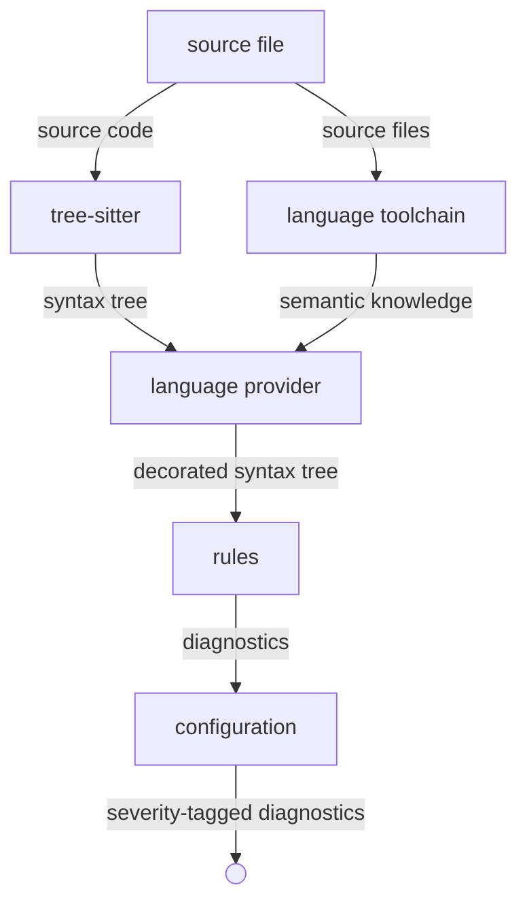
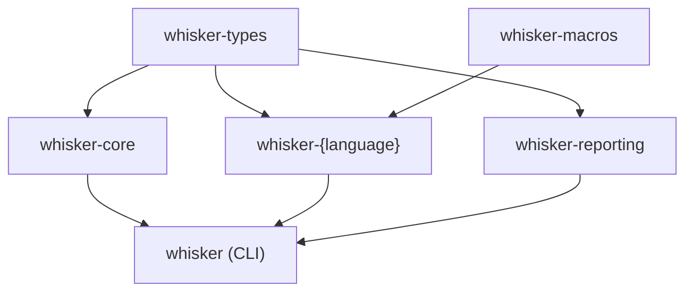

# Architecture

Whisker is a language-agnostic linting platform. It does not contain lints, and
it does not understand any programming language. Instead, it defines a protocol
between two third-party extension points — **decoration providers** and
**rules** — and orchestrates data flow between them.

## Data flow

Source code enters the system and diagnostics leave it. Everything in between is
a pipeline of transformations on a single central structure: the decorated
syntax tree.

The first three stages are mechanical: parse into a syntax tree, attach semantic
information to that tree, walk the tree through rules. The fourth stage is pure
policy: configuration maps rule output to severities, decides what to suppress,
and formats the result for the consumer (CLI, IDE, CI).

Rules never see configuration. They produce factual statements — "this node
matches this pattern" — and the platform decides what those statements mean.

## The decorated syntax tree

The decorated syntax tree is the only data structure that crosses boundaries. It
is a tree-sitter syntax tree with a decoration overlay keyed by node identity.
The tree-sitter tree is never modified.

Decorations are per-node, not per-span. The provider resolves flow-sensitive
information — type narrowing, borrow scopes, lock regions — and attaches the
resolved result to each individual node. A rule never reasons about control flow
or scoping; it reads per-node facts.

This is the fundamental bet of the architecture: providers do the heavy semantic
lifting so that rules stay simple.

## Extension points

There are two extension points. They do not know about each other.

### Decoration providers

A provider receives a parsed syntax tree and returns decorations. It owns the
relationship with a language toolchain (rust-analyzer, tsserver, gopls, etc.)
and translates the toolchain's understanding into platform-level decoration
types. How it connects to the toolchain, what protocol it speaks, what scope it
analyzes, how it caches — all of that is internal to the provider. The platform
sees only the decorations that come out.

Decoration types are the anti-corruption layer between toolchain internals and
the rest of the system. They come in three flavors:

- **Value** — self-contained semantic facts about a node.
- **Relational** — references from one node to another.
- **Derived** — references from one decoration to another.

### Rules

A rule receives decorated nodes one at a time and returns diagnostics. Rules may
be stateful across nodes within a file — for example, tracking scope depth — but
their only output channel is the diagnostics they return. No side effects, no
mutation of the tree, no communication between rules.

A diagnostic is a factual finding: a location, a message, a severity, optional
related locations, and optional suggested fixes. Rules declare the severity they
consider appropriate; configuration may override it.

## Crate structure

- **`whisker-types`** — shared vocabulary. Decorated node, diagnostics, lint pass
  contract, and decoration traits. The common dependency for everything that
  touches the linting domain.
- **`whisker-core`** — the engine. Pipeline orchestration and tree walker.
  Drives the parse-decorate-inspect-report flow.
- **`whisker-macros`** — code generators. Produces language SDK code from two
  independent inputs (described below). Does not depend on `whisker-types` at
  runtime.
- **`whisker-{language}`** — a language SDK. One per supported language. Combines
  generated and authored code into the crate that rule authors depend on.
- **`whisker-reporting`** — diagnostic formatting and output. Consumes
  severity-tagged diagnostics from the pipeline and renders them for the target
  consumer (terminal, IDE, CI).
- **`whisker`** — the CLI binary. Owns the CLI contract and configuration.

## Code generation

Two independent generators produce the language SDK layer. They consume different
inputs, have different change cadences, and can be versioned separately.

The **visitor generator** reads tree-sitter's `node-types.json` for a language
grammar and produces a language-specific lint pass trait. This trait bridges the
platform's generic node-level contract to language-specific node kinds. Node
kinds are entirely language-specific — there is no universal taxonomy.

The **decoration generator** reads authored decoration types and produces
accessors on the decorated node. Cardinality (one or many per node) is declared
on the authored type and determines the accessor shape.

## Seams

The system is designed to change at specific boundaries without rippling across
layers.

**Adding a language** means writing a new `whisker-{language}` crate: authored
decoration types, a provider implementation, and running the generators. Nothing
in `whisker-core` changes. No existing language SDK changes.

**Adding a rule** means implementing the language-specific lint pass trait in a
new module. No changes to the SDK, the provider, or the platform.

**Adding a decoration** means authoring a new type in the language SDK and
re-running the decoration generator. Existing rules are unaffected — they
simply don't access the new decoration.

**Changing a language toolchain** is contained entirely within the provider. The
decoration types are the stable interface; the provider's internals can be
rewritten without touching rules.

**Changing tree-sitter grammars** affects the visitor generator output. This may
add or remove methods on the language-specific lint pass trait, which can break
rules that relied on removed node kinds. This is intentional — grammar changes
are breaking changes at the rule level, and the type system surfaces them.

**Changing output format** is contained within `whisker-reporting`. Adding a new
renderer (e.g. SARIF, JSON) does not touch the pipeline or rules.

**Configuration** is invisible to rules and providers. Changes to severity
mappings or suppressions never cross into the pipeline.
